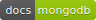

<p align="center"></p>
<p align="center">
  <a href="https://goreportcard.com/report/go.mongodb.org/mongo-driver"></a>
  <a href="https://godoc.org/go.mongodb.org/mongo-driver/mongo"></a>
  <a href="https://godoc.org/go.mongodb.org/mongo-driver/bson"></a>
  <a href="https://docs.mongodb.com/ecosystem/drivers/go/"></a>
</p>

# MongoDB Go Driver

The MongoDB supported driver for Go.

-------------------------
- [Requirements](#requirements)
- [Installation](#installation)
- [Usage](#usage)
- [Bugs/Feature Reporting](#bugs-feature-reporting)
- [Testing / Development](#testing--development)
- [Continuous Integration](#continuous-integration)
- [License](#license)

-------------------------
## Requirements

- Go 1.10 or higher. We aim to support the latest supported versions of go.
- MongoDB 2.6 and higher.

-------------------------
## Installation

The recommended way to get started using the MongoDB Go driver is by using `dep` to install the dependency in your project.

```bash
dep ensure -add "go.mongodb.org/mongo-driver/mongo@>=1.0.0-rc2"
```

-------------------------
## Usage

To get started with the driver, import the `mongo` package, create a `mongo.Client`:

```go
import "go.mongodb.org/mongo-driver/mongo"

client, err := mongo.NewClient(options.Client().ApplyURI("mongodb://localhost:27017"))
```

And connect it to your running MongoDB server:

```go
ctx, _ := context.WithTimeout(context.Background(), 10*time.Second)
err = client.Connect(ctx)
```

To do this in a single step, you can use the `Connect` function:

```go
ctx, _ := context.WithTimeout(context.Background(), 10*time.Second)
client, err := mongo.Connect(ctx, options.Client().ApplyURI("mongodb://localhost:27017"))
```

Calling `Connect` does not block for server discovery. If you wish to know if a MongoDB server has been found and connected to,
use the `Ping` method:

```go
ctx, _ = context.WithTimeout(context.Background(), 2*time.Second)
err = client.Ping(ctx, readpref.Primary())
```

To insert a document into a collection, first retrieve a `Database` and then `Collection` instance from the `Client`:

```go
collection := client.Database("testing").Collection("numbers")
```

The `Collection` instance can then be used to insert documents:

```go
ctx, _ = context.WithTimeout(context.Background(), 5*time.Second)
res, err := collection.InsertOne(ctx, bson.M{"name": "pi", "value": 3.14159})
id := res.InsertedID
```

Several query methods return a cursor, which can be used like this:

```go
ctx, _ = context.WithTimeout(context.Background(), 30*time.Second)
cur, err := collection.Find(ctx, bson.D{})
if err != nil { log.Fatal(err) }
defer cur.Close(ctx)
for cur.Next(ctx) {
   var result bson.M
   err := cur.Decode(&result)
   if err != nil { log.Fatal(err) }
   // do something with result....
}
if err := cur.Err(); err != nil {
  log.Fatal(err)
}
```

For methods that return a single item, a `SingleResult` instance is returned:

```go
var result struct {
    Value float64
}
filter := bson.M{"name": "pi"}
ctx, _ = context.WithTimeout(context.Background(), 5*time.Second)
err = collection.FindOne(ctx, filter).Decode(&result)
if err != nil {
    log.Fatal(err)
}
// Do something with result...
```

Additional examples and documentation can be found under the examples directory and [on the MongoDB Documentation website](https://docs.mongodb.com/ecosystem/drivers/go/).

-------------------------
## Bugs / Feature Reporting

New Features and bugs can be reported on jira: https://jira.mongodb.org/browse/GODRIVER

-------------------------
## Testing / Development

To run driver tests, make sure a MongoDB server instance is running at localhost:27017. Using make, you can run `make` (on windows, run `nmake`).
This will run coverage, run go-lint, run go-vet, and build the examples.

The MongoDB Go Driver is not feature complete, so any help is appreciated. Check out the [project page](https://jira.mongodb.org/browse/GODRIVER)
for tickets that need completing. See our [contribution guidelines](CONTRIBUTING.md) for details.

-------------------------
## Continuous Integration

Commits to master are run automatically on [evergreen](https://evergreen.mongodb.com/waterfall/mongo-go-driver).

-------------------------
## Thanks and Acknowledgement 

<a href="https://github.com/ashleymcnamara">@ashleymcnamara</a> - Mongo Gopher Artwork

-------------------------
## License

The MongoDB Go Driver is licensed under the [Apache License](LICENSE).
